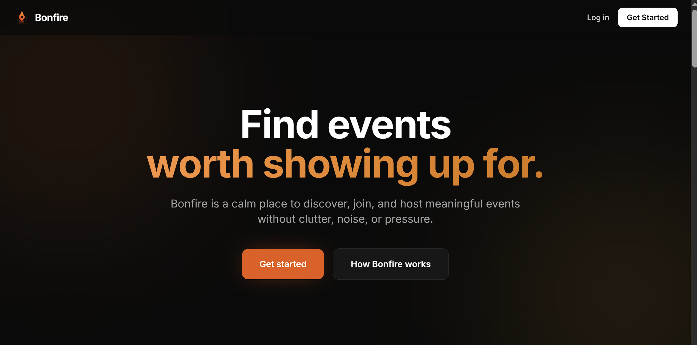
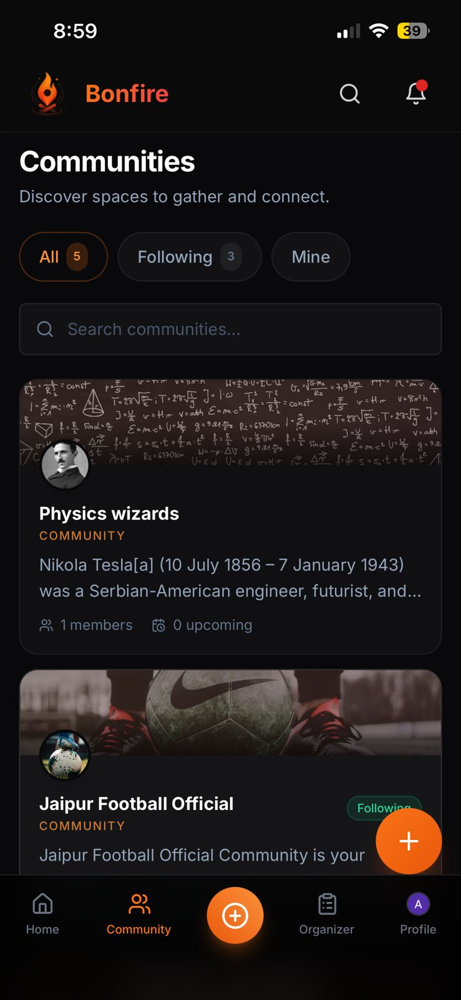
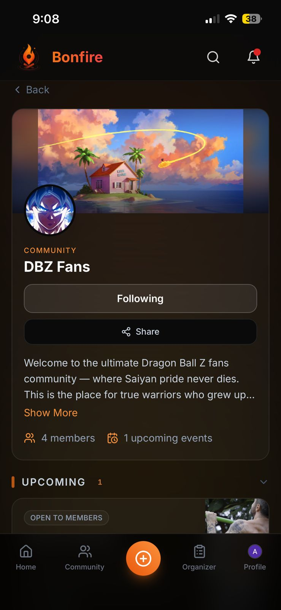
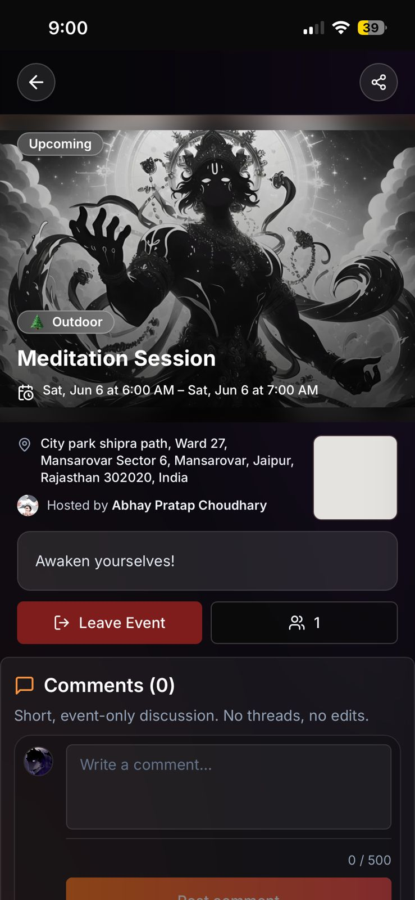
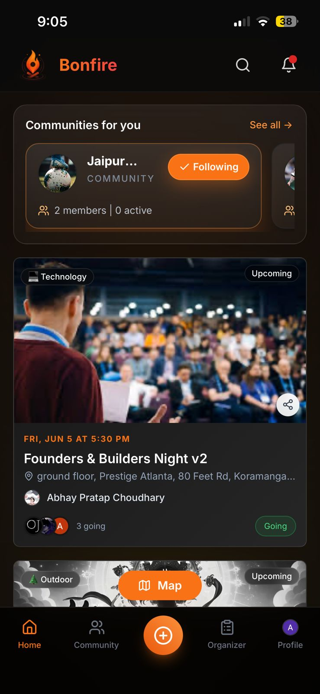
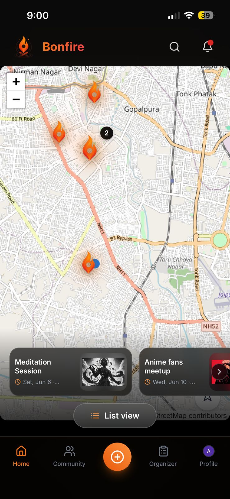

# Bonfire 🔥

**AI-Powered Community & Event Discovery Platform**

Version: 0.1.0 — 2026-06-03

Bonfire is a location-first platform that helps people discover, create, and join real-world events through communities. It replaces fragmented event discovery across messaging apps, social media, and offline channels with a unified experience designed for real-world coordination.

<p align="center">
  
</p>

<p align="center">
  <a href="https://bonfire-web.netlify.app/">Live Demo</a> ·
  <a href="https://drive.google.com/file/d/132wKiDGCnPW9IJ_7oO6qSFyvqcjJatBh/view?usp=sharing">Full Product Walkthrough</a>
</p>

---

## Overview

Traditional event discovery is fragmented.

Events are often buried inside WhatsApp groups, Instagram stories, Discord servers, posters, and word-of-mouth networks. As a result, people miss opportunities to connect with nearby communities and attend events they care about.

Bonfire solves this by providing:

- 📍 Location-based event discovery
- 🤖 AI-assisted event creation
- 👥 Community-driven engagement
- ⚡ Real-time event participation
- 📱 Mobile-first Progressive Web App experience

The platform is designed around one core idea:

> Location should matter more than follower count.

---

## Screenshots

### AI Event Creation

<div align="center">
  <figure style="max-width:720px;margin:0 auto;">
    
    <figcaption style="font-size:0.95rem;margin-top:8px;color:#666;">Generate complete event details from natural language prompts in a few seconds.</figcaption>
  </figure>
</div>

### Communities

| Community Discovery                                                                                                                                                                     | Community Page                                                                                                                                                                |
| --------------------------------------------------------------------------------------------------------------------------------------------------------------------------------------- | ----------------------------------------------------------------------------------------------------------------------------------------------------------------------------- |
|  |  |
| Browse and discover communities.                                                                                                                                                        | Engage with members and community-hosted events.                                                                                                                              |

### Event Experience

<div align="center">
  <figure style="max-width:780px;margin:0 auto;">
    
    <figcaption style="font-size:0.95rem;margin-top:8px;color:#666;">Event details, attendance, location, and participation are presented in one clear view.</figcaption>
  </figure>
</div>

### Mobile Experience

Bonfire supports multiple discovery modes optimized for mobile users.

| List View                                                                                                                                                                                      | Map View                                                                                                                                                                                     |
| ---------------------------------------------------------------------------------------------------------------------------------------------------------------------------------------------- | -------------------------------------------------------------------------------------------------------------------------------------------------------------------------------------------- |
|  |  |
| List View                                                                                                                                                                                      | Map View                                                                                                                                                                                     |

---

## Key Features

### AI-Powered Event Creation

Create events using natural language prompts. Users can describe an event in plain English, and Bonfire automatically generates event details to reduce setup friction (see `components/organizer/ai-event-generator` and the `/api/ai` endpoint).

---

### Location-Based Discovery

Discover events happening nearby through geospatial search.

- Radius-based querying
- Nearby event recommendations
- Location-aware event browsing

---

### Community System

Communities serve as persistent spaces where members can organize recurring events.

Features include:

- Community creation
- Member management
- Community-based event hosting
- Long-term engagement loops

---

### Event Management

Users can:

- Create events
- Join events
- Track attendance
- Manage event details
- View event information in real time

---

### Real-Time Updates

Bonfire supports:

- Live attendee counts
- Event updates
- Real-time synchronization across users

---

### Progressive Web App (PWA)

Mobile-first experience with:

- Installable application
- Fast loading
- Responsive design
- Native-like user experience

---

## Product Philosophy

Bonfire is built around a few simple principles:

### Location > Followers

Events should be discovered because they are relevant, not because users follow the organizer.

### Intent > Passive Scrolling

The platform prioritizes meaningful participation over endless content consumption.

### Communities Drive Retention

Events are temporary. Communities create long-term engagement.

### Real-World Outcomes Matter

Success is measured by people showing up and connecting in real life.

---

## Architecture

### Core Entities

```
User
 ├── Creates Events
 ├── Joins Communities
 └── Attends Events

Community
 ├── Hosts Events
 └── Manages Members

Event
 ├── Has Attendees
 └── Belongs to Community (optional)
```

---

## Tech Stack

### Frontend

- Next.js (App Router)
- React 18
- TypeScript
- Tailwind CSS

### Backend

- Supabase
- PostgreSQL
- Realtime Subscriptions

### Infrastructure

- Progressive Web App (PWA)
- Geospatial Search (Leaflet + clustering)
- Authentication & Authorization

### AI

- Azure OpenAI integration for AI-powered event generation workflows

---

## Environment Variables

Copy the values below into `.env.local` (use `.env.example` as a template). Keep server-side keys secret and never expose them to the browser.

```
NEXT_PUBLIC_SUPABASE_URL=
NEXT_PUBLIC_SUPABASE_ANON_KEY=
NEXT_PUBLIC_GOOGLE_MAPS_API_KEY=
SUPABASE_SERVICE_ROLE_KEY=
AZURE_OPENAI_ENDPOINT=
AZURE_OPENAI_KEY=
AZURE_OPENAI_DEPLOYMENT_ID=
```

- `NEXT_PUBLIC_SUPABASE_URL` / `NEXT_PUBLIC_SUPABASE_ANON_KEY`: Supabase project URL and anon key used for client auth and requests.
- `NEXT_PUBLIC_GOOGLE_MAPS_API_KEY`: Optional — used for embedded Google Maps preview on event detail pages.
- `SUPABASE_SERVICE_ROLE_KEY`: Required for certain server-side operations and migrations. Keep secret and never expose to the client.
- Azure OpenAI keys (`AZURE_OPENAI_ENDPOINT`, `AZURE_OPENAI_KEY`, `AZURE_OPENAI_DEPLOYMENT_ID`): Used by the AI event generation API. These are server-side credentials — do not expose in the browser.

---

## Installation

1. Clone the repository and install dependencies:

```bash
git clone https://github.com/yourusername/bonfire.git
cd bonfire
npm install
```

2. Create `.env.local` from `.env.example` and fill in the values.

3. Run the development server:

```bash
npm run dev
```

Open `http://localhost:3000` in your browser. The app requires a Supabase project for auth/data; see `lib/supabase.ts` for the client setup.

---

## Database Design

Key models:

```
Users
Communities
Community Memberships
Events
Event Attendees
```

Relationships:

```
User
 ├── joins Community
 ├── creates Event
 └── attends Event

Community
 └── hosts Events
```

---

## Scalability Considerations

- Geospatial indexing
- Efficient radius-based queries
- Pagination support
- Real-time subscriptions
- Community-centric architecture
- Extensible recommendation system

---

## Future Roadmap

- Personalized event recommendations
- Interest-based discovery
- Community feeds
- Event chat
- Trust & verification systems
- Community analytics
- Advanced moderation tools

---

## Changelog

- 0.1.0 (2026-06-03)
  - Initial project scaffold and core features: map discovery, event pages, auth, and organizer flows.

- Unreleased / 2026-06-02
  - AI event creation feature: natural-language event generation and server-side API integration.
  - Added calendar page and map side menu for improved discovery.
  - Organizer UI: profile modal, private-event controls, invite flow fixes, and attendee count bug fixes.
  - Landing page merged with the app, added legal pages, and Google site verification meta tag.
  - PWA manifest and icon updates; improved mobile responsiveness and multiple UI fixes.
  - `.env.example` updated with Azure OpenAI and Supabase service role vars.

---

## Why Bonfire?

Most platforms optimize for screen time. Bonfire optimizes for real-world interactions. The goal is simple:

**Help people discover communities, attend events, and build meaningful connections offline.**

---

## Author

**Abhay Pratap Choudhary**

IIT Roorkee
Building products at the intersection of AI, communities, and real-world experiences.
